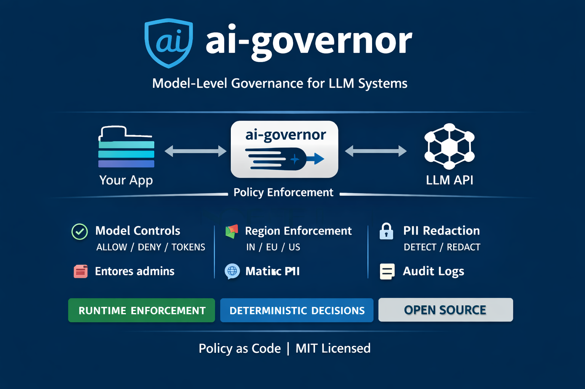

<p align="center">
  
</p>

# ai-governor
[](https://github.com/ugenkudupudiqbnox/ai-governor/actions/workflows/v0_3_contract.yml)
[](LICENSE)
[](https://discord.gg/qPmpZdNYAC)

**ai-governorr** is an open-source, MIT-licensed **model-level governance runtime** for Large Language Model (LLM) systems.

It provides deterministic, auditable controls that sit **between your application and the model**, enforcing policy *before* any model execution occurs.

ai-governor is not a prompt framework or a safety wrapper.  
It is a **governance control plane**.

---

## Why ai-governor Exists

LLMs are now production infrastructure:
- handling sensitive data
- influencing real-world decisions
- operating in regulated environments

Yet most LLM systems ship without:
- enforceable policies
- deterministic decisions
- audit-grade evidence

ai-governor exists to close that gap with **governance as code**, enforced at runtime.

---

## Project Status

**Alpha (v0.3)**

ai-governor provides a **feature-complete governance runtime** with frozen core contracts.  
It is stable enough for early production use, but APIs and schemas may evolve in future minor versions.

Stability and compatibility guarantees are documented in [`docs/STABILITY.md`](docs/STABILITY.md).

---

## What ai-governor Does

- Policy-as-code (YAML / JSON)
- Deterministic decisions: `ALLOW`, `BLOCK`, `MODIFY`
- Model allow / deny enforcement
- Region / jurisdiction enforcement
- Tool / agent governance
- PII detection with deterministic redaction
- Audit-grade JSON logs
- CLI & CI/CD integration

No LLM calls. No provider lock-in.

---

## What ai-governor Is Not

ai-governor is **not**:
- a chatbot framework
- a prompt engineering library
- a hosted SaaS service
- a compliance certification tool

It enforces **technical controls**, not legal interpretations.

---

## Architecture & Flow

```text
Application / API / CI
        |
        v
+------------------------+
| EnforcementOrchestrator|
+------------------------+
        |
        v
   Policy Validation
        |
        v
Enforcement Orchestrator
   ├─ Model Enforcement
   ├─ Region Enforcement
   ├─ Tool Governance
   ├─ PII Enforcement
   └─ Redaction (if required)
        |
        v
   Decision + Audit Event
```

---

## Quick Start (CLI)

```bash
pip install -e .

ai-governor validate policy.yaml

ai-governor enforce \
  --policy policy.yaml \
  --model gpt-4.1 \
  --region IN \
  --text "Email me at test@example.com"
```

Exit codes are CI-friendly:
- `0` → ALLOW
- `10` → MODIFY
- `20` → BLOCK

---

## Demo Application

This repository includes **example applications** that demonstrate how ai-governor is used at real integration boundaries.

### Script-based Demo

Location:
```
examples/demo_app/
```

This demo shows:
- governance before model invocation
- explicit BLOCK / MODIFY behavior
- deterministic redaction
- audit emission

Run:
```bash
python examples/demo_app/app.py examples/demo_app/request_modify.json
```

### FastAPI Demo (Illustrative Only)

A minimal FastAPI-based HTTP demo is available under:

```
examples/fastapi_demo/
```

This demo is **illustrative only** and is **not part of the stable API contract**.

---

## CI / CD Example

ai-governor is designed to act as a **deployment gate**.

```bash
ai-governor validate policy.yaml &&
ai-governor enforce \
  --policy policy.yaml \
  --model gpt-4.1 \
  --region IN \
  --text "hello"
```

A `BLOCK` decision fails the pipeline automatically.

---

## Roadmap

### v0.3 (Current – Alpha, Feature Frozen)
- Policy composition & inheritance
- Tool / agent governance
- Region enforcement
- Deterministic redaction
- Hardened audit sinks
- Stable CLI & orchestrator contracts

### v0.4 (Planned)
- Policy schema v0.2
- Tool argument-level governance
- Additional audit sinks (non-core)
- Integration examples

---

## Security

Security and correctness are first-class concerns.

If you discover a vulnerability, please follow the responsible disclosure process in [`SECURITY.md`](SECURITY.md).

---

## Contributing

See [`CONTRIBUTING.md`](CONTRIBUTING.md) for contribution guidelines and discipline.

---

## License

MIT License. See [`LICENSE`](LICENSE).

---

**ai-governor does not try to make AI safe.**  
It makes AI **governable**.

## v0.4.0-alpha

- Adds schema v0.2 support
- Adds metadata validation
- Adds model family governance
- Adds tool argument-level governance
- Maintains full v0.3 contract compatibility